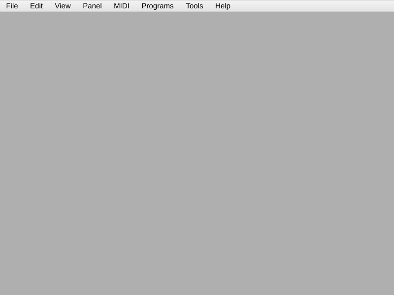

[← Index](README.md) | Next: [02 — Core Concepts →](02-core-concepts.md)

---

# 01 — Getting Started

> **TL;DR**
> - CtrlrX runs as a **Standalone** app or as a **plugin** (VST3 / AU, optionally VST2 / AAX) inside a DAW.
> - A **panel** is the document you build — it holds your controls, their MIDI mappings, and any Lua scripts.
> - Launch the standalone, create a new panel, and you're ready for [Chapter 3](03-first-panel.md).

## Contents

- [What is CtrlrX?](#what-is-ctrlrx)
- [Standalone vs. plugin](#standalone-vs-plugin)
- [Installing / launching](#installing--launching)
- [First launch](#first-launch)
- [Create a new panel](#create-a-new-panel)
- [Where to go next](#where-to-go-next)

---

## What is CtrlrX?

CtrlrX is a tool for building **custom control surfaces for MIDI gear**. Your hardware synth has
knobs and buttons that send and receive MIDI; CtrlrX lets you draw your *own* set of on-screen knobs
and buttons, wire each one to a MIDI message, and optionally add logic with the Lua scripting
language. The result — a **panel** — can act as an editor, a librarian, or a remote control for
anything that speaks MIDI.

CtrlrX is a maintained fork of Roman Kubiak's original *Ctrlr*, built on the
[JUCE](https://juce.com) framework.

## Standalone vs. plugin

CtrlrX is the *same* engine in two wrappers:

| Form | Use it when… |
|---|---|
| **Standalone** application | You want a self-contained app to control hardware, or you're building/editing a panel. |
| **Plugin** (VST3, AU, and optionally VST2/AAX) | You want the panel inside your DAW so its controls can be **automated** and recalled with your project. |

> 💡 Tip: Build and edit your panel in the **Standalone** app — it's the most direct workflow. You
> can always load the finished panel into the plugin later.

## Installing / launching

### Download a release build (recommended)

The easiest way to get CtrlrX is the prebuilt binary distribution. Download the latest build for your
operating system from the releases page:

**<https://github.com/damiensellier/CtrlrX/releases>**

Each release contains a **Standalone** app and the **plugin** formats for that OS.

**Run the Standalone:**

| OS | What you get | How to run |
|---|---|---|
| **Windows** | `CtrlrX.exe` | Double-click it (you may need to allow it past SmartScreen the first time). |
| **macOS** | `CtrlrX.app` | Open it. First launch: right-click → **Open** to get past Gatekeeper for an unsigned build. |
| **Linux** | `CtrlrX` executable | Make it executable (`chmod +x CtrlrX`) and run it. |

**Install the plugin** by copying the format your DAW uses into the standard folder:

| Format | Windows | macOS | Linux |
|---|---|---|---|
| **VST3** | `C:\Program Files\Common Files\VST3` | `~/Library/Audio/Plug-Ins/VST3` | `~/.vst3` |
| **AU** (macOS only) | — | `~/Library/Audio/Plug-Ins/Components` | — |
| **VST2** (if built) | your VST2 folder | `~/Library/Audio/Plug-Ins/VST` | `~/.vst` |

Then rescan plugins in your DAW.

> ⚠️ Gotcha: builds are typically signed these days. If you catch an unsigned build that is blocked: first double check you trust the source (downloaded from the correct link), then:\
> MacOS: Right-click the app/plugin → **Open**, or clear the quarantine flag: `xattr -dr com.apple.quarantine /path/to/CtrlrX.app`. \
> Windows: When the 'protected your PC' dialog appears, click "Run anyway"

### If you build from source

CtrlrX builds with CMake and a vendored JUCE submodule. First install the build dependencies
for your platform — the repository's [README](../../README.md#compiling-ctrlrx) lists them in
full (on Debian/Ubuntu this means `build-essential`, `cmake`, `pkg-config`, and a set of X11,
ALSA, and binutils development packages). On **macOS** you need the Xcode command-line tools plus
CMake; on **Windows**, Visual Studio (with the C++ workload) plus CMake. 

If your system does not have the Boost libraries (v1.0 or any later version) installed, unzip the vendored Boost once — extract `Source/Misc/boost/boost.zip` in place (any unzip tool works):

```bash
cd Source/Misc/boost && unzip boost.zip && cd -   # Windows: extract boost.zip with Explorer / 7-Zip. Only needed if Boost isn't already installed.
```

Then fetch the submodules, configure, and build:

```bash
git submodule update --init --recursive          # first time only
cmake -B build -DCMAKE_BUILD_TYPE=Release .      # configure
cmake --build build --config Release             # build
```

The standalone artefact lands under `build/CtrlrX_artefacts/<Debug|Release>/Standalone/`:

| OS | Artefact |
|---|---|
| **Linux** | `CtrlrX` (executable) |
| **Windows** | `CtrlrX.exe` |
| **macOS** | `CtrlrX.app` |

The plugin formats build alongside it (e.g. `VST3/CtrlrX.vst3`, and `AU/CtrlrX.component` on macOS).

> 🔗 Deeper: per-platform dependency lists and build notes (Windows, macOS, Debian, Fedora)
> live in the repository's [README](../../README.md#compiling-ctrlrx).

## First launch

Start the Standalone app. You'll get an empty editor window with a blank panel in the middle and a
**Properties** panel down one side.



The menu bar across the top is your main control center:

| Menu | What lives here |
|---|---|
| **File** | New / Open / Save / Export panels, save the global CTRLR state |
| **Edit** | Undo / redo, cut / copy / paste of selected modulators |
| **View** | Toggle editor panes |
| **Panel** | **Panel Mode** (edit/use toggle), Panel lock, Modulator list, Layer editor, LUA Editor, LUA Console |
| **MIDI** | Choose Input / Output / Controller devices and channels |
| **Programs** | Snapshot / program management |
| **Tools** | MIDI Monitor, MIDI Calculator, Log viewer, Comparator tables |

Don't worry about memorizing these — [Chapter 2](02-core-concepts.md) explains the editor, and the
later chapters walk you through each menu as you need it.

## Create a new panel

**Goal:** get a fresh, empty panel to build on.

**Steps**
1. **File → New Panel**.
2. In the **Properties** panel, fill in at least **Panel Name**, **Author**, and **Version** (e.g. major `0`, minor `1`).
3. **File → Save As…** and choose a location. Your panel is saved as a `.panel` file (XML).

**How it works**

A panel is fundamentally a JUCE `ValueTree` — a tree of properties — serialized to disk. The
**Properties** panel is just an editor for that tree. A `.panel` file is human-readable XML, which is
why it's friendly to version control and easy to inspect. CtrlrX can also write compressed and binary
variants (`.panelz`, `.bpanel`, `.bpanelz`); see [Chapter 10](10-distribution.md) for when to use
each.

> ⚠️ Gotcha: Save early and often. Use **File → Save versioned** to keep numbered backups — building
> a panel involves a lot of fiddly layout work that you don't want to lose.

## Where to go next

You *could* dive straight into [Chapter 3](03-first-panel.md) and start clicking. But the editor uses
a few terms — **modulator**, **component**, **Panel Mode** — in specific ways. Five minutes in
[Chapter 2](02-core-concepts.md) will make everything afterward click into place.

---

[← Index](README.md) | Next: [02 — Core Concepts →](02-core-concepts.md)
