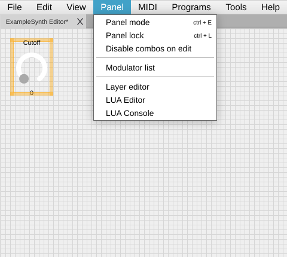
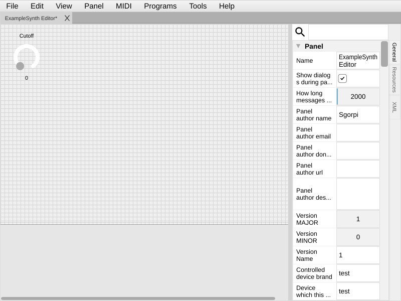
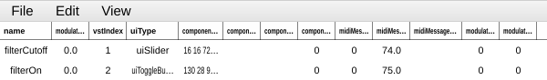
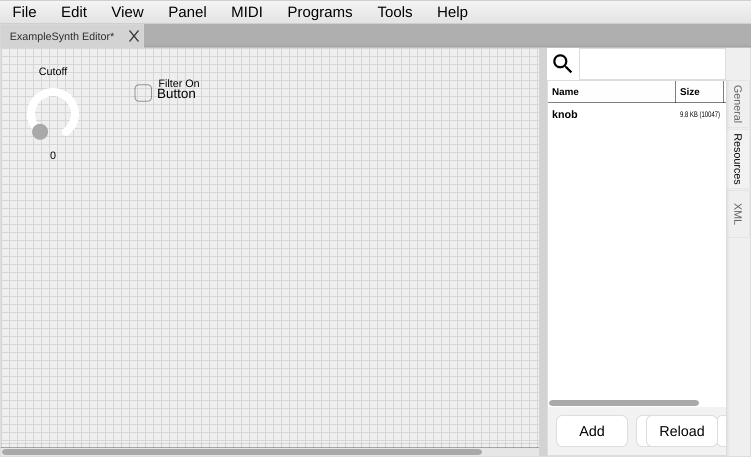

[← 01 Getting Started](01-getting-started.md) | [Index](README.md) | Next: [03 — Your First Panel →](03-first-panel.md)

---

# 02 — Core Concepts

> **TL;DR**
> - A **modulator** = one control. It has two halves: a **component** (what you see) and a value/MIDI **processor** (what it does).
> - **Edit mode** is for building; **Panel mode** is for using. Toggle with **Panel → Panel Mode** (Ctrl/Cmd+E).
> - The **Properties** panel edits the selected modulator. The **Modulator list** lets you reach controls you can't click.
> - **Resources** are the images/fonts your panel uses. **Layers/Groups/Tabs** organize controls.

## Contents

- [Modulator vs. component (the one distinction to learn)](#modulator-vs-component-the-one-distinction-to-learn)
- [Edit mode vs. Panel mode](#edit-mode-vs-panel-mode)
- [The editor at a glance](#the-editor-at-a-glance)
- [The Modulator list](#the-modulator-list)
- [Resources: images and fonts](#resources-images-and-fonts)
- [Organizing a panel: groups, tabs, and layers](#organizing-a-panel-groups-tabs-and-layers)
- [The mental model, end to end](#the-mental-model-end-to-end)

---

## Modulator vs. component (the one distinction to learn)

This trips up every newcomer, so let's settle it up front.

- A **modulator** is the whole control: its name, its value, its range, its MIDI mapping, *and* its
  appearance. Everything you add to a panel is a modulator.
- A **component** is just the **visual** part of a modulator — the actual knob, button, or label you
  see and drag with the mouse.

Think of it as: **the modulator is the brain, the component is the body.**

```
Modulator  "filterCutoff"
 ├─ Component        → a rotary knob drawn at (40,40), 64×64 px   (uiSlider)
 └─ Processor        → value 0–127, sends CC #74 on channel 1
```

Why two words for one thing? Because a modulator's *value* and its *MIDI behavior* are independent of
how it looks. You can swap a knob's component for a slider's without changing what MIDI it sends. In
Lua you'll often fetch one from the other:

```lua
local mod = panel:getModulatorByName("filterCutoff")  -- the modulator
local comp = mod:getComponent()                        -- its component
```

> ⚠️ Gotcha: Some elements are **static** — labels, images, groups, tabs, arrows, progress bars.
> They are still modulators, but they don't produce a value or send MIDI. (See the *static* note in
> [Chapter 4](04-gui-elements.md).)

## Edit mode vs. Panel mode

CtrlrX has exactly two modes, and you'll switch between them constantly.

| Mode | What you can do | How to enter |
|---|---|---|
| **Edit mode** | Add controls, drag them, resize them, change properties, write Lua | Default when building |
| **Panel mode** | *Use* the panel — move knobs, send MIDI, play | **Panel → Panel Mode** or **Ctrl/Cmd+E** |



> 💡 Tip: If clicking a knob *moves* it instead of *selecting* it, you're in Panel mode. Press
> **Ctrl/Cmd+E** to get back to Edit mode.

## The editor at a glance

In Edit mode the window has three regions you'll use all the time:



1. **The canvas** — the panel itself, where controls live. Right-click it to **Add component**.
2. **The Properties panel** — a long, scrollable list of every property of the *currently selected*
   modulator. This is where 90% of your building happens.
3. **The Resources tab** — usually beside Properties; this is where you upload images and fonts
   (see below).

> 💡 Tip: The Properties panel is long. The properties are grouped (Modulator, Component generic,
> Component, MIDI, …). Scroll — the property you want is almost always there.

## The Modulator list

Once controls are grouped or have **size and position locked**, you often can't click them directly on
the canvas. The **Modulator list** is your way in.

**Goal:** select a control you can't reach with the mouse.

**Steps**
1. **Panel → Modulator list**.
2. Click the modulator's row.
3. The Properties panel now shows that modulator — edit away.



## Resources: images and fonts

Image-based controls (an image knob, an image button, a panel background) need their image **uploaded
into the panel** first. CtrlrX stores these inside the panel file as **resources** so the panel is
self-contained and portable.

**Goal:** make an image available to use.

**Steps**
1. Open the **Resources** tab (beside the Properties panel).
2. Click **Add** and pick your image file (PNG is a safe choice).
3. The image is now selectable in any property that takes an image resource.



> 🔗 Deeper: filmstrip images for knobs/buttons and how frames map to values are covered in
> [Chapter 4](04-gui-elements.md); reaching resources from Lua is in the
> [Lua reference](lua/02-lua-reference.md).

## Organizing a panel: groups, tabs, and layers

As panels grow you'll want structure. CtrlrX gives you three tools:

| Tool | What it does | Type |
|---|---|---|
| **Group** (`uiGroup`) | A container; move the group and its members move together | grouping |
| **Tabs** (`uiTabs`) | Multiple pages of controls behind tab headers | grouping |
| **Layers** | Stacking order / show-hide planes for the canvas (Panel → layer editor) | canvas |

Use **Tabs** to split a big editor into sections (e.g. "Oscillators", "Filter", "Librarian"). Use
**Groups** to keep a cluster of related knobs moving as a unit. Use **Layers** to control what's drawn
on top of what.

> 🔗 Deeper: building your first tab is the first task in [Chapter 3](03-first-panel.md).

## The mental model, end to end

When you move a knob in Panel mode, this happens:

```
You drag the component  →  modulator value changes  →  processor builds a MIDI message
   →  message goes out the selected MIDI Output  →  (optionally) a Lua callback runs
```

And in reverse, when MIDI arrives:

```
MIDI In  →  input comparator matches it to a modulator  →  modulator value updates
   →  component repaints  →  (optionally) a Lua callback runs
```

Keep this loop in mind — every later chapter is just filling in one of these arrows.

---

[← 01 Getting Started](01-getting-started.md) | [Index](README.md) | Next: [03 — Your First Panel →](03-first-panel.md)
