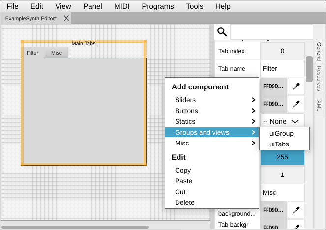
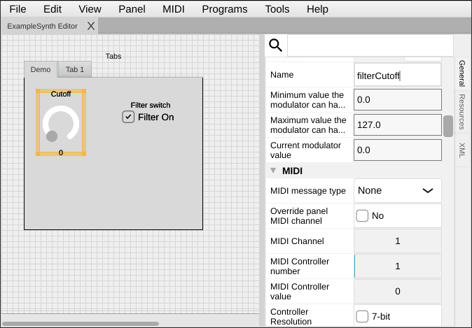

[← 02 Core Concepts](02-core-concepts.md) | [Index](README.md) | Next: [04 — GUI Elements →](04-gui-elements.md)

---

# 03 — Your First Panel

> **TL;DR**
> - Create a panel, give it a name and size, then add a **uiTabs** to organize it.
> - Add a knob (**uiSlider**) and a switch (**uiToggleButton**) to a tab.
> - Save. You now have a panel skeleton — [Chapter 7](07-making-responsive.md) makes it send MIDI.

[← 02 Core Concepts](02-core-concepts.md) · [Index](README.md) · Next: [04 — GUI Elements →](04-gui-elements.md)

---

This chapter starts the **example panel** we build through Chapter 8: a small editor for a fictional
synth, **ExampleSynth**, with a filter-cutoff knob and a filter on/off switch. No hardware required.

## Step 1 — Create and name the panel

**Steps**
1. **File → New Panel**.
2. In the **Properties** panel set:
   - **Panel Name**: `ExampleSynth Editor`
   - **Author**: your name
   - **Version**: major `0`, minor `1`
   - **Vendor / Device**: `Example` / `ExampleSynth` (optional, shows up when used as a plugin)
3. **File → Save As…** → `first-panel.panel`.

> 💡 Tip: The panel name becomes the tab title if you open several panels at once, and is used when
> the panel runs as a plugin.

## Step 2 — Set the panel size

The blank white area is your panel. Set its size to give yourself room to work.

**Steps**
1. Click an empty part of the canvas to select the **panel** itself (not a control).
2. In Properties, find **Panel width** / **Panel height**. Set something like `700 × 400`.
3. You can also drag the panel's edge to resize it later.

## Step 3 — Add a tabs container

We'll put our controls inside a tab so the panel is easy to extend later.

**Steps**
1. **Right-click** an empty part of the canvas → **Add component → Groups and views → uiTabs**.
2. A new modulator (named something like `modulator-1`) appears. Click it to select it.
3. In Properties:
   - **Name** (under *Modulator*): `mainTabs`
   - Scroll to the bottom and click **Add tab** twice to create two tabs.
   - Set the tab names to `Filter` and `Misc` (look for the **Tab name** property).
4. Resize the tabs component to roughly fill the panel by dragging its orange border.

**How it works**

`uiTabs` is a *grouping* component (see [Chapter 4](04-gui-elements.md)). Controls you drop onto a tab
become members of that tab and move/hide with it. Organizing early saves painful rearranging later.

> ⚠️ Gotcha: After clicking **Add tab**, the Properties panel may not refresh immediately. Click an
> empty area of the canvas, then re-select the tabs component to see the new tab's properties.

## Step 4 — Add a knob

Now the star of the show: a rotary knob for filter cutoff.

**Steps**
1. Make sure the **Filter** tab is the active tab.
2. Right-click on an empty panel area → **Add component → Sliders → uiSlider**.
3. Select the new modulator and set in Properties:
   - **Name**: `filterCutoff`
   - **Visible name**: `Cutoff`
   - **Slider style**: `RotaryVerticalDrag` (makes it a knob you drag up/down)
   - **Minimum value**: `0`
   - **Maximum value**: `127`
   - **Value position**: `NoTextBox` (or `TextBoxBelow` if you want to see the number)
4. Drag and drop the knob to a tidy spot on the Filter tab to make it part of the tab.

> 💡 Tip: Prefer a knob made from a custom image? Use **uiImageSlider** instead and assign an image
> resource — see [Chapter 4](04-gui-elements.md). For now, the plain `uiSlider` keeps us moving.

## Step 5 — Add a switch

**Steps**
1. Still on the Filter tab, right-click → **Add component → Buttons → uiToggleButton**.
2. Select it and set:
   - **Name**: `filterOn`
   - **Visible name**: `Filter switch` (the label)
   - **Name label visible**: deselect
   - **Button text**: `Filter On`
   - **Minimum value**: `0`, **Maximum value**: `1`
3. Drag it into the tab and position it next to the knob.

## Step 6 — Try Panel mode

**Steps**
1. **Panel → Panel Mode** (or **Ctrl/Cmd+E**).
2. Drag the knob and click the switch. They respond — but nothing leaves the panel yet, because we
   haven't mapped them to MIDI.
3. Press **Ctrl/Cmd+E** again to return to Edit mode.

## Step 7 — Save

**File → Save** (Ctrl/Cmd+S). Consider **File → Save versioned** to snapshot this milestone.

## What you have now

A panel with a tabbed layout, a knob, and a switch — the visual skeleton. Next:

- Want to understand the *full* palette of controls before going on? → [Chapter 4 — GUI Elements](04-gui-elements.md)
- Want the knob to mean "0–127 Hz" instead of raw numbers? → [Chapter 5 — Value Mapping](05-value-mapping.md)
- Want it to actually send MIDI? → [Chapter 6 — MIDI Basics](06-midi-basics.md) then [Chapter 7](07-making-responsive.md)

---

[← 02 Core Concepts](02-core-concepts.md) | [Index](README.md) | Next: [04 — GUI Elements →](04-gui-elements.md)
