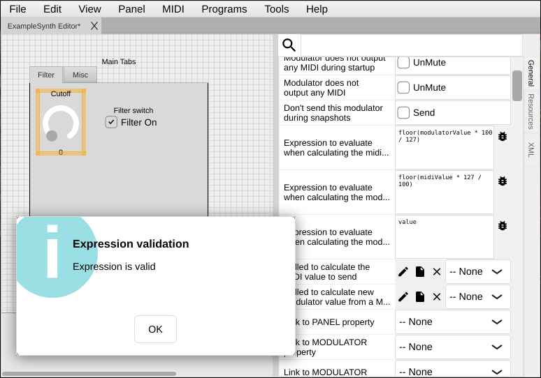

[← 04 GUI Elements](04-gui-elements.md) | [Index](README.md) | Next: [06 — MIDI Basics →](06-midi-basics.md)

---

# 05 — Value Mapping

> **TL;DR**
> - Every control has a raw **value** between **Minimum** and **Maximum** (often 0–127, the MIDI range).
> - **Non-mapped value** = the raw number. **Mapped value** = what it *means* (Hz, a name, etc.).
> - A **value map** translates raw values ↔ display text/values. Combos and fixed sliders use it for named choices.
> - In Lua: `getValue()`/`setValue()` for raw, `getValueMapped()`/`setValueMapped()` for mapped.

[← 04 GUI Elements](04-gui-elements.md) · [Index](README.md) · Next: [06 — MIDI Basics →](06-midi-basics.md)

---

## Raw range: Minimum and Maximum

The simplest mapping is just a range. Under the **Component** property group:

- **Minimum value** — the lowest raw value (commonly `0`).
- **Maximum value** — the highest raw value (commonly `127` for a 7-bit MIDI parameter, `16383` for a
  14-bit one, `1` for an on/off switch).

The raw value is what the control stores and, by default, what it sends as MIDI. For our example
cutoff knob we used `0–127`.

> ⚠️ Gotcha: Match **Maximum value** to your MIDI resolution. A 7-bit CC tops out at `127`; using a
> 14-bit (Multi/NRPN) parameter means `16383`. See [Chapter 8](08-sending-receiving.md).

## Mapped vs. non-mapped values

CtrlrX separates two ideas:

| Term | Meaning | Example |
|---|---|---|
| **Non-mapped value** | The raw number the control holds. | `64` |
| **Mapped value** | The human-meaningful value it represents. | `"Sawtooth"`, or `2000 Hz` |

For a plain knob the two are usually identical. They diverge when you attach a **value map**.

## Value maps (named choices and lookup tables)

A **value map** is a list of pairs: *raw value → display text* (and optionally a numeric mapped
value). It's what turns a dropdown of numbers into a dropdown of names.

**Goal:** give a combo box named choices.

**Steps**
1. Add a **uiCombo** (or **uiFixedSlider**) and select it.
2. Find its **value map / item list** property (the list editor in Properties).
3. Enter pairs, one per line, e.g.:
   ```
   0=Sine
   1=Triangle
   2=Sawtooth
   3=Square
   ```
4. Set **Maximum value** to match the highest index (`3` here).

Now the control shows `Sine…Square`, but still sends `0…3` as MIDI.

**How it works**

Internally a value map (`CtrlrValueMap`) keeps an ordered set of *non-mapped* values, each paired with
a *mapped* value and a *text*. The component shows the text; the processor sends the value. The same
machinery powers `uiFixedSlider`/`uiFixedImageSlider`, which step through the map's entries.

## Reading and writing values in Lua

This is where the distinction pays off:

```lua
local m = panel:getModulatorByName("lfoShape")

m:getValue()           -- raw value, e.g. 2
m:getValueMapped()     -- mapped value (number) for that entry
m:getValueNonMapped()  -- explicit raw value
-- integer variants exist: getValueInt(), getValueMappedInt(), getValueNonMappedInt()

m:setValue(2)          -- set raw value
m:setValueMapped(...)  -- set by mapped value
m:setValueNonMapped(...)
```

Ranges, too:

```lua
m:getMinModulatorValue(), m:getMaxModulatorValue()  -- raw range
m:getMinMapped(),        m:getMaxMapped()           -- mapped range
m:getMinNonMapped(),     m:getMaxNonMapped()
```

> 🔗 Deeper: the full modulator API (and the older `getModulatorValue`/`setModulatorValue` aliases
> you'll see in existing panels) is in the [Lua reference](lua/02-lua-reference.md#ctrlrmodulator).

## Expression properties (math without Lua)

> **TL;DR** — For computed mappings you don't need Lua. Each modulator has three **expression**
> formulas (outgoing, incoming, controller). Type a formula in the property's box, hit the **🐞
> validate button** to check it, and CtrlrX runs it on every value change. Full constant/function
> reference is at the end of this section.

For simple, computed mappings you don't need Lua at all. Each modulator has three **expression**
properties (in the *Modulator* property group) that are evaluated as math formulas. They default to
pass-through, so by default the modulator value *is* the MIDI value.

| Property (label in the editor) | Internal name | Direction | Default |
|---|---|---|---|
| **Expression to evaluate when calculating the midi message value from the modulator value** | `modulatorValueExpression` | modulator value → outgoing MIDI value | `modulatorValue` |
| **Expression to evaluate when calculating the modulator value from the midi message value** | `modulatorValueExpressionReverse` | incoming MIDI value → modulator value | `midiValue` |
| **Expression to evaluate when calculating the modulator value from midi controller message** | `modulatorControllerExpression` | controller (MIDI-learn) input → modulator value | `value` |

The first two are the ones you'll use most: the *forward* expression shapes what gets **sent** when
the control moves, and the *reverse* expression shapes how an **incoming** MIDI value becomes the
control's value. The third only applies when a hardware controller is mapped to the modulator via
MIDI-learn; its `value` symbol is the raw incoming controller value.

### The formula box and the 🐞 validate button

Each expression property is edited in a small **multi-line text box** with a **bug (🐞) button** next
to it (tooltip: *"Compile expression, if it's valid set the property"*). The button is a quick
syntax check:

- Click it (or just leave the field / press Return) and CtrlrX **compiles** the formula.
- **Valid** → the property is saved and you get an *"Expression is valid"* confirmation.
- **Invalid** → the box turns **pink** and a *"Validation failed: …"* message shows the parse error.

> ⚠️ Gotcha: the validate button checks that the formula **parses** — it does not preview the
> computed result for a given input. To see actual numbers, watch the control in the
> [MIDI Monitor](09-debugging.md) while you move it.



**Example** — halve the value on the way out and double it on the way back in:

```
forward (to MIDI):   floor(modulatorValue / 2)
reverse (from MIDI): midiValue * 2
```

> 💡 Tip: Use expressions for linear/scaling/bit-twiddling. Reach for Lua (below) only when the
> relationship is a lookup table or needs real logic.

### Expression reference — constants

These symbols resolve to the modulator's current state at evaluation time. `modulatorValue` is a
linear array index and is always ≥ 0; the *mapped* variants pass through the modulator's value map
(see above) and **can be negative**.

| Constant | Value |
|---|---|
| `modulatorValue` | Current linear (non-mapped) value of the modulator — the index into its value array; always ≥ 0. |
| `modulatorMappedValue` | Current value **after** the value map is applied (may be negative). |
| `modulatorMin` / `modulatorMax` | The modulator's minimum / maximum non-mapped value. |
| `modulatorMappedMin` / `modulatorMappedMax` | The minimum / maximum value **after** mapping. |
| `midiValue` | The value currently held in the MIDI message tied to the modulator. |
| `midiNumber` | The controller/number of that MIDI message (e.g. the CC number), if applicable. |
| `vstIndex` | The VST/AU parameter index as the host sees it (integer). |
| `value` | *(controller expression only)* the raw incoming controller value. |

You can also read **another modulator's** value with `panel.<modulatorName>`, and panel **global
variables** through the `global` scope (write them with the `setGlobal` function below).

### Expression reference — functions

Ordinary arithmetic (`+ - * /`, parentheses) works as expected. The built-in functions are:

| Function | Args | Returns |
|---|---|---|
| `ceil(x)` | 1 | Smallest integer ≥ `x`. |
| `floor(x)` | 1 | Largest integer ≤ `x`. |
| `abs(x)` | 1 | Absolute value of `x`. |
| `mod(a, b)` | 2 | Integer modulo `a % b` (e.g. `10 % 3 = 1`). |
| `fmod(a, b)` | 2 | Floating-point remainder of `a / b`. |
| `pow(a, b)` | 2 | `a` raised to the power `b` (`a^b`). |
| `min(a, b)` / `max(a, b)` | 2 | The smaller / larger of the two. |
| `eq(a, b, t, f)` | 4 | `t` if `a == b`, else `f`. |
| `gt(a, b, t, f)` | 4 | `t` if `a > b`, else `f`. |
| `gte(a, b, t, f)` | 4 | `t` if `a >= b`, else `f`. |
| `lt(a, b, t, f)` | 4 | `t` if `a < b`, else `f`. |
| `lte(a, b, t, f)` | 4 | `t` if `a <= b`, else `f`. |
| `isBitSet(value, bit)` | 2 | `1` if `bit` is set in `value`, else `0`. |
| `setBit(value, bit, on)` | 3 | `value` with `bit` set (`on` ≠ 0) or cleared, returned as an integer. |
| `clearBit(value, bit)` | 2 | `value` with `bit` cleared. |
| `getBitRangeAsInt(value, startBit, numBits)` | 3 | The `numBits` bits starting at `startBit`, as an integer. |
| `setBitRangeAsInt(value, startBit, numBits, toSet)` | 4 | `value` with that bit range replaced by `toSet`. |
| `setGlobal(index, newValue)` | 2 | Sets panel global variable `index` and returns `newValue` (so the expression can continue). |
| `getModulatorByVstIndex(i)` | 1 | The current value of the modulator whose VST index is `i` (`-1` if none). |
| `getModulatorByCustomIndex(i)` | 1 | The current value of the modulator whose custom index is `i` (`-1` if none). |

The comparison functions (`eq`/`gt`/`gte`/`lt`/`lte`) are CtrlrX's substitute for an `if`: they take
the two operands **plus** the value to return when the test passes and when it fails. For example:

```
gte(modulatorValue, 0, modulatorValue, 128 - modulatorValue)
```

returns `modulatorValue` when it is ≥ 0, and `128 - modulatorValue` otherwise.

> 🔗 Deeper: the constants come from `CtrlrModulatorProcessor::getSymbolValue`
> ([Source/Core/CtrlrModulator/CtrlrModulatorProcessor.cpp](../../Source/Core/CtrlrModulator/CtrlrModulatorProcessor.cpp))
> and the functions from `evaluateFormulaFunction`
> ([Source/Core/CtrlrPanel/CtrlrEvaluationScopes.cpp](../../Source/Core/CtrlrPanel/CtrlrEvaluationScopes.cpp)) —
> both good places to look if a formula misbehaves.

## When you need an arbitrary lookup

Sometimes a parameter's raw MIDI value maps to a non-linear real-world value (classic example: an
envelope time where MIDI `0–255` maps to `0…60` seconds non-linearly). Two approaches:

1. **Value map** — if the relationship is a fixed list, enter it as pairs.
2. **Lua + a table** — for computed relationships, keep a Lua table and a helper function:
   ```lua
   EnvTimes = { 0, 0.002, 0.005, 0.01, --[[ … ]] }
   function timeForMidi(v) return EnvTimes[v + 1] end   -- 0-based MIDI → seconds (1-based table)
   ```

### Tying the lookup to a control

That helper function does nothing on its own — a **callback** has to call it. Pick the callback that
matches what you're doing (all three live in the modulator's *Modulator* property group, each as a
method dropdown with **Add new method** / **Edit** buttons — see [Chapter 7](07-making-responsive.md)):

| You want to… | Use the callback labelled… | (internal name) |
|---|---|---|
| Show the real-world value on a label/LCD when the knob moves | **Called when the modulator value changes** | `luaModulatorValueChange` |
| Convert the modulator value into the byte(s) you send | **Called to calculate the MIDI value to send** | `luaModulatorGetValueForMIDI` |
| Convert an incoming MIDI value back into the modulator value | **Called to calculate new modulator value from a MIDI value** | `luaModulatorGetValueFromMIDI` |

For example, to display the envelope time whenever the knob moves, create a method, assign it to
**Called when the modulator value changes**, and have it do:

```lua
envTimeChanged = function(mod, value)
    local seconds = timeForMidi(value)
    panel:getModulatorByName("envTimeLabel"):getComponent()
         :setComponentText(string.format("%.3f s", seconds))
end
```

> 🔗 Deeper: how to create and assign these methods is in [Chapter 7](07-making-responsive.md); the
> full callback list (and exact argument lists) is in the
> [Lua reference](lua/02-lua-reference.md#callback-hooks).

---

[← 04 GUI Elements](04-gui-elements.md) | [Index](README.md) | Next: [06 — MIDI Basics →](06-midi-basics.md)
