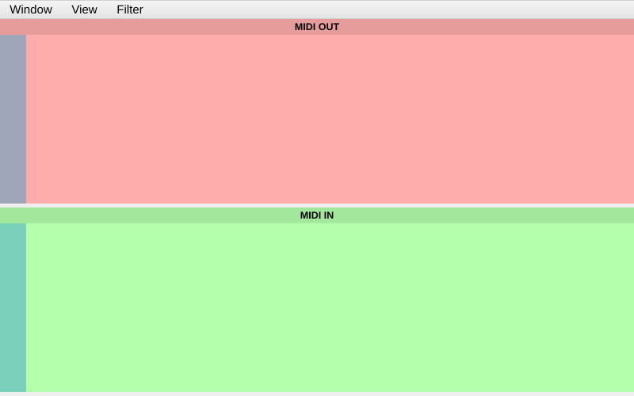

[← 05 Value Mapping](05-value-mapping.md) | [Index](README.md) | Next: [07 — Making Elements Responsive →](07-making-responsive.md)

---

# 06 — MIDI Basics & Connecting Devices

> **TL;DR**
> - MIDI carries small messages: **CC**, **Note**, **Program Change**, **Pitch Bend**, **Aftertouch**, **SysEx**, and more.
> - CtrlrX has three device roles: **Output** (panel → gear), **Input** (gear → panel), **Controller** (a hardware controller → panel).
> - Set them under the **MIDI** menu. No hardware? Use a **virtual/loopback MIDI port** to test.
> - Then open **Tools → MIDI Monitor** to watch messages flow.

[← 05 Value Mapping](05-value-mapping.md) · [Index](README.md) · Next: [07 — Making Elements Responsive →](07-making-responsive.md)

---

## A 60-second MIDI primer

MIDI messages are short. The ones you'll use most:

| Message | Bytes (hex) | Carries |
|---|---|---|
| **Control Change (CC)** | `Bn cc vv` | Controller `cc` (0–127) set to value `vv` (0–127) |
| **Note On / Off** | `9n nn vv` / `8n nn vv` | Note `nn` with velocity `vv` |
| **Program Change** | `Cn pp` | Program/patch number `pp` |
| **Pitch Bend** | `En ll mm` | 14-bit bend value (0–16383) |
| **Channel Pressure** | `Dn vv` | Channel aftertouch |
| **Polyphonic Aftertouch** | `An nn vv` | Per-note pressure |
| **System Exclusive (SysEx)** | `F0 … F7` | Manufacturer-defined data of any length |

In `Bn`, the `n` is the **channel** (0–15 in the wire format = channels 1–16 as you'd say them).

> 💡 Tip: A value above 127 needs more than one byte. **14-bit** parameters (0–16383) split the value
> into MSB + LSB across two messages — that's what **Multi** messages and **NRPN** handle. See
> [Chapter 8](08-sending-receiving.md).

> 🔗 Deeper: the complete list of message types CtrlrX understands, and how each is configured on a
> modulator, is in [Chapter 7](07-making-responsive.md) and [Chapter 8](08-sending-receiving.md).

## The three device roles

CtrlrX distinguishes how a device is used:

| Role | Direction | Purpose |
|---|---|---|
| **Output** | CtrlrX → device | Send your panel's MIDI to the synth. |
| **Input** | device → CtrlrX | Receive MIDI *from* the synth so the panel can update. |
| **Controller** | controller → CtrlrX | Map a separate hardware controller's knobs to your panel (with MIDI Learn). |

For a basic "edit my synth" panel you mainly need **Output** (to send) and **Input** (to receive
changes made on the synth itself).

## Connect a device

**Goal:** choose where MIDI goes and comes from.

**Steps**
1. **MIDI → Output → Device** → pick your synth (or a virtual port — see below).
2. **MIDI → Output → Channel** → pick the channel your synth listens on (e.g. 1).
3. (Optional) **MIDI → Input → Device** → pick the port the synth sends on.
4. A confirmation appears at the bottom of the window when a connection is established.

> ⚠️ Gotcha: If your newly-connected device doesn't appear in the list, CtrlrX may need to rescan.
> Re-open the MIDI menu; if it's still missing, restart CtrlrX.

## MIDI Thru: passing messages between ports

Beyond sending its own controls, CtrlrX can **forward** MIDI straight through — e.g. let notes from
your master keyboard (an Input device) reach the synth (the Output device) while the panel is open.
Open the **MIDI Settings** dialog (MIDI menu) and choose the **Routing** tab. Each route is a
checkbox, with an optional *Change MIDI Channel* toggle beside it that re-channels the forwarded
message to the destination's channel:

| Route (as labelled) | Forwards |
|---|---|
| **IN Device → OUT Device** | Incoming hardware MIDI straight to your synth. |
| **CTRL Device → OUT Device** | Your controller keyboard to the synth. |
| **HOST → OUT Device** | MIDI from the plugin host (DAW) to the synth. |
| **HOST → HOST** | Host MIDI back out to the host. |
| **In Device → Host** | Incoming hardware MIDI up to the host. |

> 💡 Tip: Leave all thru routes **off** for a plain editor panel — turn one on only when you actually
> want CtrlrX to act as a MIDI patchbay (e.g. play the synth from a keyboard through the open panel).

> 🔗 Deeper: the full routing matrix and channelize behaviour are described on the
> [Ctrlr MIDI Thru capabilities](https://github.com/damiensellier/CtrlrX/wiki/Ctrlr-MIDI-Thru-capabilities)
> wiki page.

## Testing without hardware: a virtual MIDI port

You don't need a synth to learn — create a **loopback** port and watch CtrlrX talk to itself.

- **Linux:** the ALSA virtual MIDI client, e.g. `sudo modprobe snd-virmidi`, gives you "Virtual Raw
  MIDI" ports. Or use `a2jmidid` / a DAW's virtual port.
- **macOS:** enable the **IAC Driver** in *Audio MIDI Setup → MIDI Studio*.
- **Windows:** install **loopMIDI** (a free virtual MIDI cable).

Then set CtrlrX's **Output** (and optionally **Input**) to that virtual port. Anything the panel sends
shows up in the MIDI Monitor — proof your mappings work.

## Watch the traffic: the MIDI Monitor

**Steps**
1. **Tools → MIDI Monitor**.
2. In its **View** menu, enable what you want to see (channel, number, value, raw bytes) and turn on
   **Monitor input** and **Monitor output**.
3. Move a mapped control (after [Chapter 7](07-making-responsive.md)) and watch messages appear —
   **outgoing** in one colour, **incoming** in another.

> 💡 Tip: Keep the MIDI Monitor open on a second screen while building. It's the fastest way to
> confirm a control is sending exactly the bytes you intended.

---

[← 05 Value Mapping](05-value-mapping.md) | [Index](README.md) | Next: [07 — Making Elements Responsive →](07-making-responsive.md)
