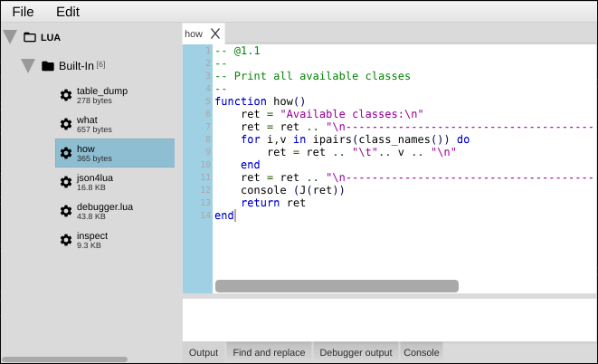

[← 06 MIDI Basics](06-midi-basics.md) | [Index](README.md) | Next: [08 — Sending & Receiving MIDI →](08-sending-receiving.md)

---

# 07 — Making Elements Responsive

> **TL;DR**
> - A control becomes useful two ways: it **sends MIDI**, and/or it **runs Lua** when something happens.
> - For MIDI: set the **MIDI message type** + **channel** + **number** in the control's *MIDI* properties.
> - For logic: attach a **Lua method** to a callback (e.g. *modulator value changed*).
> - The two combine freely: a control can send MIDI *and* trigger a script.

## Contents

- [Path A — send MIDI](#path-a--send-midi)
- [Path B — run a Lua method](#path-b--run-a-lua-method)
- [Combining both](#combining-both)

---

A control on the canvas does nothing on its own. You make it responsive by giving it a **MIDI
mapping**, a **Lua method**, or both. This chapter covers the wiring; [Chapter 8](08-sending-receiving.md)
goes deep on the trickier MIDI types.

## Path A — send MIDI

**Goal:** make our `filterCutoff` knob send CC #74 on channel 1.

**Steps**
1. Select `filterCutoff`.
2. In the **MIDI** property group set:
   - **MIDI message type**: `CC`
   - **MIDI Channel**: `1`
   - **MIDI controller number**: `74`
   - (**Maximum value** is already `127` from [Chapter 3](03-first-panel.md).)
3. Switch to **Panel Mode** (Ctrl/Cmd+E) and drag the knob.
4. With a MIDI Output (or virtual port) selected and the **MIDI Monitor** open, you'll see
   `B0 4A vv` messages — that's CC 74 on channel 1.

**How it works**

The modulator's *processor* turns each value change into a MIDI message of the configured type. CC is
the simplest: a 3-byte `Bn cc vv` message where `cc` is your controller number and `vv` is the
current value (0–127). When you change the knob, CtrlrX emits the message on the selected output.

### The MIDI message types

A control's **MIDI message type** can be any of:

| Type | Sends | Typical use |
|---|---|---|
| **CC** | `Bn cc vv` | The workhorse — most parameters. |
| **NoteOn** / **NoteOff** | `9n nn vv` / `8n nn vv` | Triggering notes/pads. |
| **ProgramChange** | `Cn pp` | Selecting a patch/program. |
| **PitchWheel** | `En ll mm` | 14-bit bend (max value 16383). |
| **ChannelPressure** | `Dn vv` | Channel aftertouch. |
| **Aftertouch** | `An nn vv` | Polyphonic (per-note) pressure. |
| **SysEx** | `F0 … F7` | Manufacturer parameters via a formula. → [Ch. 8](08-sending-receiving.md) |
| **Multi** | several messages | 14-bit values, **NRPN/RPN**, or any sequence. → [Ch. 8](08-sending-receiving.md) |
| **MidiClock / Start / Continue / Stop**, **ActiveSense** | realtime bytes | Clock/transport. |
| **None** | nothing | A control with no MIDI (Lua-only, or display). |

> ⚠️ Gotcha: For a switch, set **Maximum value** to `1` so it sends `0`/`127` (or `0`/`1` depending
> on the parameter the device expects — check your synth's MIDI implementation).

### The key MIDI properties

| Property | Meaning |
|---|---|
| **MIDI message type** | One of the types above. |
| **MIDI Channel** | 1–16. |
| **MIDI controller number** | CC number, note number, or program number (decimal). |
| **MIDI value** | Value byte (for fixed-value messages). |
| **Multi Message list** | The sequence for **Multi** type. → [Ch. 8](08-sending-receiving.md) |
| **SysEx formula** | The byte template for **SysEx** type. → [Ch. 8](08-sending-receiving.md) |

## Path B — run a Lua method

Sometimes a control should *do* something in addition to (or instead of) sending a fixed MIDI message
— update another control, compute a value, drive a display. For that you attach a **Lua method** to
one of the control's **callbacks**.

**Goal:** print the knob's value to the console whenever it changes.

**Steps**
1. Select `filterCutoff`.
2. In Properties, find the callback you want — for value changes it's the **Called when the modulator
   value changes** callback (`luaModulatorValueChange`).
3. Click **Add new method**, name it `cutoffChanged`, and click **OK**.
4. **Select the new method in the dropdown** for that callback (it isn't auto-assigned!).
5. Click **Edit selected method** to open the Lua editor, and write:
   ```lua
   cutoffChanged = function(mod, value)
       console("cutoff = " .. value)
   end
   ```
6. Switch to Panel Mode and move the knob — values print in the Lua console
   ([Chapter 9](09-debugging.md)).



**How it works**

Each callback is a named hook CtrlrX calls at the right moment. You don't change the function's
parameter list — it's pre-wired to receive the relevant arguments (here `mod` and `value`). Your job
is the body. The same mechanism powers panel-load hooks, MIDI-received hooks, mouse/paint callbacks,
and more.

> ⚠️ Gotcha: Creating a method does **not** assign it. You must pick it in the callback's dropdown,
> or it never runs. This is the single most common "why isn't my script firing?" mistake.

> 🔗 Deeper: every available callback (panel, modulator, component, mouse, paint, drag) is listed in
> the [Lua reference](lua/02-lua-reference.md#callback-hooks). The Lua language itself is in the
> [Lua guide](lua/01-lua-guide.md).

## Combining both

A control can send MIDI **and** run Lua. Common patterns:

- Knob sends CC *and* a Lua method updates a readout label.
- Button sends nothing (`type = None`) but its Lua method sends a custom SysEx sequence.
- Combo sends a Program Change *and* a Lua method reconfigures other controls for that patch.

---

[← 06 MIDI Basics](06-midi-basics.md) | [Index](README.md) | Next: [08 — Sending & Receiving MIDI →](08-sending-receiving.md)
