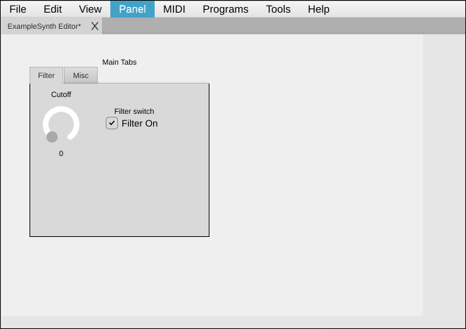

[← 07 Making Responsive](07-making-responsive.md) | [Index](README.md) | Next: [09 — Debugging →](09-debugging.md)

---

# 08 — Sending & Receiving MIDI

> **TL;DR**
> - **Multi** messages send a *sequence* — use them for 14-bit values, **NRPN/RPN**, or any combo.
> - **SysEx** messages use a **formula**: a byte template with tokens that get filled in at send time.
> - **Receiving**: CtrlrX matches incoming MIDI to a modulator (by type/channel/number) and updates it automatically; use callbacks for custom handling.

[← 07 Making Responsive](07-making-responsive.md) · [Index](README.md) · Next: [09 — Debugging →](09-debugging.md)

---

[Chapter 7](07-making-responsive.md) covered the simple types (CC, Note, PC…). This chapter handles
the two powerful ones — **Multi** and **SysEx** — and explains how a panel *receives* MIDI.

## Multi messages (14-bit, NRPN/RPN, sequences)

Set **MIDI message type = Multi** and fill in the **Multi Message list**. The list is a sequence of
messages separated by **colons** `:`. Each message is comma-separated:

```
Type[,Number[,Value]] : Type[,Number[,Value]] : …
```

For **Number** and **Value** you can use:

| Token | Means |
|---|---|
| `Direct`, `Default`, `Value`, or `-1` | Use the **modulator's current value**. |
| `Number`, `CtrlNumber`, or `-2` | Use the **modulator's MIDI number**. |
| a decimal (e.g. `74`) | A literal number. |
| a 1–2 digit hex (e.g. `0x40` → write `40`) | A literal hex byte. |

### Example: a 14-bit CC (MSB + LSB)

A 0–16383 parameter split across CC 1 (MSB) and CC 33 (LSB) — set **Maximum value = 16383** and:

```
CC,1,Direct : CC,33,Direct
```

Each message takes the modulator's value and CtrlrX places the high/low 7 bits appropriately when the
value exceeds 127.

### Example: NRPN

NRPN selects a parameter with CC 99/98, then sets it with CC 6 (and optionally CC 38):

```
CC,99,2 : CC,98,10 : CC,6,Direct
```

(Parameter 2/10, data = the modulator value.)

> ⚠️ Gotcha — legacy format: older panels use a longer token form with `ByteValue`,
> `MSB7bitValue`, `LSB7bitValue` (e.g. `CC,ByteValue,MSB7bitValue,28,-1:…`). CtrlrX still understands
> these — it routes them through the SysEx engine for backward compatibility — but for **new** panels
> prefer the shorter `Type,Number,Value` form above.

### Example: a sequence of fixed messages

A "panic"-style button (type `None`, triggered from Lua or as a Multi) could send:

```
CC,123,0 : CC,120,0
```

(All notes off, all sound off.)

## SysEx messages (formulas & tokens)

System Exclusive lets a device expose parameters that have no standard MIDI message. Set **MIDI
message type = SysEx** and write a **SysEx formula**: the raw bytes of the message, with **tokens**
where dynamic data goes.

A formula is mostly literal hex bytes, plus tokens such as:

| Token | Inserts |
|---|---|
| `ByteValue` | The modulator's value as one byte. |
| `MSB7bitValue` / `LSB7bitValue` | The value's high / low 7 bits (for >127 values). |
| `MSB4bitValue` / `LSB4bitValue` | 4-bit nibbles of the value. |
| `ByteChannel` / `ByteChannel4Bit` | The MIDI channel. |
| `CurrentProgram` / `CurrentBank` | The current program / bank number. |
| `GlobalVariable` | A panel global variable. |
| `Checksum…` (`Xor`, `OnesComplement`, `SummingSimple`, `Technics`, `RolandJP8080`) | A computed checksum over the message. |
| `RolandSplitByte1..4`, `Nibble16bitLsb/Msb0..3` | Device-specific byte/nibble splits. |
| `LUAToken` / `FormulaToken` | A value computed by Lua / a sub-formula. |
| `Ignore` | A placeholder byte. |

**Conceptual example** — a single-parameter SysEx for a fictional device (manufacturer `7D`, set
parameter `0x12` to the knob value, with an XOR checksum):

```
F0 7D 12 ByteValue ChecksumXor F7
```

When the knob moves, CtrlrX substitutes `ByteValue` and computes `ChecksumXor`, then sends the
complete `F0 … F7` message.

> 🔗 Deeper: SysEx parsing/building lives in `CtrlrSysexProcessor` / `CtrlrSysexToken`
> ([Source/Core/](../../Source/Core/CtrlrSysexProcessor.h)). For complex devices, compute bytes in Lua
> and send them with `panel:sendMidiMessageNow(...)` (see below and the
> [Lua reference](lua/02-lua-reference.md#sending-midi)).

## Receiving MIDI

The reverse direction — gear → panel — mostly happens **automatically**.

**How it works**

When MIDI arrives on the selected **Input** device, CtrlrX's *input comparator* tries to match it to a
modulator by **message type + channel + number** (and, for SysEx, by matching the data pattern). On a
match, that modulator's value is updated and its component repaints — your on-screen knob follows the
hardware.

For this to work, the receiving modulator must be configured with the **same** MIDI type/channel/
number it sends. In practice, a control that sends CC 74 on channel 1 will also *receive* CC 74 on
channel 1 with no extra setup.

### Custom receive handling with Lua

When automatic matching isn't enough (e.g. parsing a bulk SysEx dump, or one message updating many
controls), use a panel callback:

```lua
-- assign this to the panel's "midi received" callback (luaPanelMidiReceived)
panelMidiReceived = function(midi)
    if midi:getMidiMessageType() == CC and midi:getNumber() == 74 then
        panel:getModulatorByName("filterCutoff"):setValue(midi:getValue())
    end
end
```

| Callback | Fires when |
|---|---|
| `luaPanelMidiReceived` | Any MIDI message is received. |
| `luaPanelMidiMultiReceived` | A multi-part message is received. |
| `luaModulatorValueChange` | A modulator's value changes (with a `source` arg telling you *why* — host, MIDI in, GUI, Lua…). |

> 🔗 Deeper: the `source` enum on `luaModulatorValueChange` (initial / host / midiIn / controller /
> gui / lua / program / link / unknown) lets you avoid feedback loops — e.g. *don't* re-send MIDI when
> the change *came from* MIDI in. See the [Lua reference](lua/02-lua-reference.md#callback-hooks) and
> the worked examples on the
> [Source filter with LUA scripts](https://github.com/damiensellier/CtrlrX/wiki/Source-filter-with-LUA-scripts)
> wiki page.

## Sending MIDI from Lua

You're not limited to a control's configured message. From any method:

```lua
panel:sendMidiMessageNow("F0 7D 12 40 F7")          -- a raw SysEx string
panel:sendMidiMessageNow(CtrlrMidiMessage("B0 4A 7F"))  -- a CtrlrMidiMessage
```

> 🔗 Deeper: `sendMidiMessageNow`, `sendMidi` (with a timestamp), and constructing `CtrlrMidiMessage`
> objects are documented in the [Lua reference](lua/02-lua-reference.md#sending-midi).

## Bulk dumps — many modulators in one message

> **TL;DR** — Instead of packing a big SysEx dump byte by byte, tag the modulators with a **custom
> index property**, then let CtrlrX serialize all their values into one block with
> `panel:getModulatorValuesAsData(...)` (to send) and unpack an incoming dump with
> `panel:setModulatorValuesFromData(...)` (to receive). You choose how each value is encoded.

Many synths load/save a whole patch as a single SysEx "bulk dump": a header, then one byte (or a
nibble pair, or two bytes…) per parameter, in a fixed order, then a checksum and `F7`. Wiring that up
control-by-control is painful. CtrlrX gives you two panel methods that walk your modulators in a
defined order and pack/unpack the data for you.

The order is defined by a **custom property** you add to each modulator (any name — e.g. `dumpIndex`)
holding a **non-negative integer** (`0`, `1`, `2`, …). Modulators without the property are skipped;
the block is sized to `(highestIndex + 1) × bytesPerValue`.

### Encoding types

Both methods take a `byteEncoding` telling CtrlrX how each modulator value maps to bytes. Access them
as `CtrlrPanel.<name>`:

| Encoding | Layout |
|---|---|
| `EncodeNormal` | One 7-bit byte (0–127). |
| `EncodeMSBFirst` *(alias `Encode7bitMSBFirst`)* | Two 7-bit bytes, MSB then LSB. |
| `EncodeLSBFirst` *(alias `Encode7bitLSBFirst`)* | Two 7-bit bytes, LSB then MSB. |
| `EncodeNibbleMsbFirst` *(alias `Encode4bitMsbFirst` / `EncodeMsbFirst`)* | Two 4-bit nibbles, MSB nibble first (unsigned). |
| `EncodeNibbleLsbFirst` *(alias `Encode4bitLsbFirst` / `EncodeLsbFirst`)* | Two 4-bit nibbles, LSB nibble first (unsigned). |
| `EncodeSignedNibbleMsbFirst` | Two 4-bit nibbles, MSB first, value treated as signed int8. |
| `EncodeSignedNibbleLsbFirst` | Two 4-bit nibbles, LSB first, value treated as signed int8. |
| `Encode16bitLsbFirst` | A 16-bit value as four 4-bit nibbles, least-significant first. |
| `Encode16bitMsbFirst` | A 16-bit value as four 4-bit nibbles, most-significant first. |

The `bytesPerValue` argument must match the encoding (1 for `EncodeNormal`, 2 for the two-byte /
nibble-pair encodings, etc.).

> 💡 Tip: The **last argument, `useMappedValues`**, chooses which value gets serialized — `false` uses
> the raw modulator value, `true` uses the [mapped value](05-value-mapping.md). Use whichever matches
> what your device expects in the dump.

### Step 1 — tag the modulators (once)

Decide the dump order and set the custom index on each modulator. You can do this from the
[Lua console](09-debugging.md) once, and it's saved with the panel:

```lua
local dumpOrder = { "lfoDelay", "lfoRate", "vcfResonance", "vcfCutoff", "delay" }
for i, name in ipairs(dumpOrder) do
    -- store 0-based index as a string property named "dumpIndex"
    panel:getModulatorByName(name):setProperty("dumpIndex", tostring(i - 1), false)
end
```

To undo, remove the property again: `mod:removeProperty("dumpIndex")`.

### Step 2 — send the dump

```lua
HEADER = "F0 41 00 00 11"   -- your device's dump header
EOX    = "F7"

local data = panel:getModulatorValuesAsData("dumpIndex", CtrlrPanel.EncodeNormal, 1, false)
panel:sendMidiMessageNow(
    CtrlrMidiMessage(string.format("%s %s %s", HEADER, data:toHexString(1), EOX)))
```

`getModulatorValuesAsData` returns a `MemoryBlock`; `toHexString(1)` renders it as space-separated
hex to splice between your header and `F7`. (Add a checksum byte if your device needs one.)

### Step 3 — receive a dump

Assign this to the panel's **midi received** callback (`luaPanelMidiReceived`). Pass the **header
size as a negative number** so CtrlrX skips those header bytes and starts filling modulator index 0:

```lua
panelMidiReceived = function(midi)
    local headerSize = MemoryBlock(HEADER):getSize()
    panel:setModulatorValuesFromData(midi:getData(), "dumpIndex",
                                     CtrlrPanel.EncodeNormal, -headerSize, 1, false)
end
```

> ⚠️ Gotcha: the `propertyOffset` argument is signed. A **negative** value is a *header byte count*
> (skip that many bytes, modulators start at index 0); a **positive** value instead means "data starts
> at byte 0, but modulator indices start at this offset". For skipping a SysEx header you almost always
> want the negative form.

> 🔗 Deeper: both methods and their overloads (including a start/end-index variant) are in the
> [Lua reference](lua/02-lua-reference.md#bulk-modulator-data). See also the
> [SysEx Token List](https://github.com/damiensellier/CtrlrX/wiki/SysEx-Token-List) wiki page for the
> per-parameter token approach when you'd rather not script.

## Back to the example panel

Wire `filterCutoff` to **CC 74 / ch 1** and `filterOn` to **CC 75 / ch 1** (max value 1). Open the
MIDI Monitor, switch to Panel mode, and confirm both send. If you have a virtual Input loopback, send
CC 74 back in and watch the knob move on its own. Save — that's the finished
[example/first-panel.panel](example/first-panel.panel):



---

[← 07 Making Responsive](07-making-responsive.md) | [Index](README.md) | Next: [09 — Debugging →](09-debugging.md)
