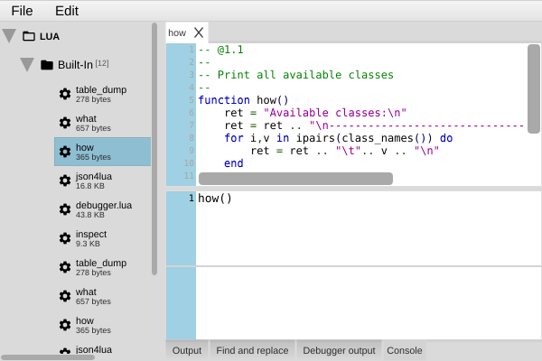

[← 08 Sending & Receiving](08-sending-receiving.md) | [Index](README.md) | Next: [10 — Distribution & Advanced →](10-distribution.md)

---

# 09 — Debugging

> **TL;DR**
> - **MIDI Monitor** (Tools menu) shows every byte in/out — your first stop for "is it sending?".
> - **Lua console** (Panel → LUA Console, or the LUA Editor's **Console** tab) runs Lua live and prints `console(...)` output.
> - `how()` lists all classes bound to Lua; `what(obj)` lists the methods of one object.
> - Most "it doesn't work" cases are: wrong mode, unassigned Lua method, or a MIDI device not selected.

[← 08 Sending & Receiving](08-sending-receiving.md) · [Index](README.md) · Next: [10 — Distribution & Advanced →](10-distribution.md)

---

## Tool 1 — the MIDI Monitor

Covered in [Chapter 6](06-midi-basics.md), it's worth repeating: **Tools → MIDI Monitor** is the
ground truth for MIDI. If a control "isn't working", check here first:

- **Nothing appears when you move a control** → it has no MIDI mapping, you're in Edit mode, or no
  Output device is selected.
- **Bytes appear but the synth ignores them** → wrong channel, wrong CC/number, or the synth expects
  SysEx/NRPN, not CC.
- **Incoming (green) messages don't move your control** → the control's receive mapping doesn't match
  (type/channel/number), or no Input device is selected.

## Tool 2 — the Lua console

The console runs Lua statements immediately against the loaded panel — perfect for poking at things.

**Steps**
1. Open it via **Panel → LUA Console**, or the **Console** tab at the bottom of the LUA Editor.
2. Type a statement and run it:
   ```lua
   panel:getModulatorByName("filterCutoff"):getValue()
   ```
3. Use `console(...)` (or `print(...)`) inside methods to log while a panel runs.



> 💡 Tip: `console(string.format("cutoff=%d", v))` formats output. `%d` integer, `%f` float, `%s`
> string. Lua converts on the fly but you tell it the format.

## Tool 3 — introspection: `how()` and `what()`

You don't have to memorize the API — ask the running app:

```lua
how()      -- prints every class bound to Lua (Ctrlr + JUCE)

mod = panel:getModulatorByName("filterCutoff")
what(mod)               -- prints all methods available on the modulator
what(mod:getComponent())-- prints all methods on its component
```

This is the most reliable reference of all, because it reflects *exactly* what your build exposes.

> 🔗 Deeper: a curated, readable version of the same surface is the
> [Lua reference](lua/02-lua-reference.md).

## Reading Lua errors

When a method fails to compile or run, the **Output** pane (bottom of the Lua editor) shows the error
with a line number, formatted like:

```
ERROR: [string "myMethod"]:42: 'end' expected (to close 'function' at line 3)
```

The number **between the colons** (`42`) is the line in your method. Common causes:

| Symptom | Likely cause |
|---|---|
| `'end' expected` | A missing `end` for an `if`/`for`/`function`. |
| `attempt to index a nil value` | `getModulatorByName(...)` returned `nil` — check the name (case-sensitive!). |
| `'<eof>' expected` / unfinished long comment | A `--[[` block comment never closed with `]]`. |
| Method never runs | It isn't assigned in the callback dropdown ([Chapter 7](07-making-responsive.md)). |

## The usual suspects — a checklist

When something doesn't work, walk this list:

1. **Right mode?** Editing needs Edit mode; using/testing needs Panel mode (**Ctrl/Cmd+E**).
2. **MIDI devices selected?** Output for sending, Input for receiving (**MIDI** menu).
3. **Mapping correct?** Type, channel, and number match the device's MIDI implementation.
4. **Lua method assigned?** Created *and* selected in the callback dropdown.
5. **Names exact?** `getModulatorByName` is case-sensitive and must match the modulator's **Name**.
6. **Value range sane?** Max value matches the parameter's resolution (127 / 1 / 16383).
7. **Feedback loop?** If receiving MIDI re-sends MIDI, guard with the `source` argument
   ([Chapter 8](08-sending-receiving.md)).

> ⚠️ Gotcha: After reorganizing methods into folders in the Lua editor, you may need to **save and
> reopen the panel** to see the new structure.

---

[← 08 Sending & Receiving](08-sending-receiving.md) | [Index](README.md) | Next: [10 — Distribution & Advanced →](10-distribution.md)
