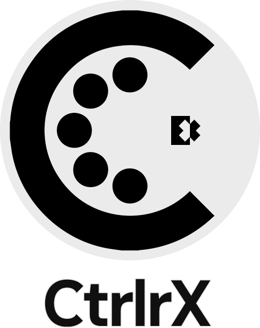
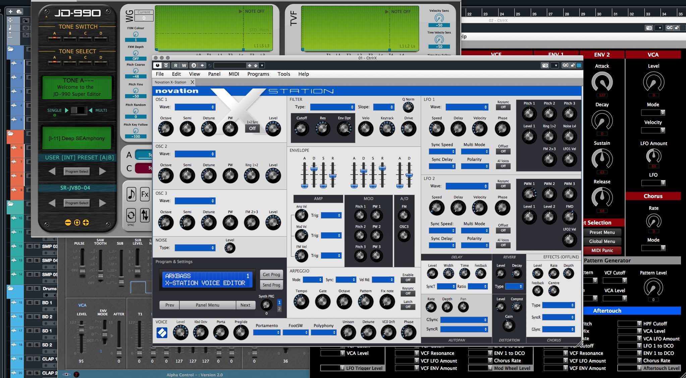

# CtrlrX — Control MIDI hardware from your DAW

> **TL;DR**
> - **CtrlrX** by Damien Sellier is an updated version of **Ctrlr** by Roman Kubiak under BSD|GPL license.
> - Based on the JUCE framework, it acts as a cross-platform standalone application or DAW plugin (VST3, AU, AAX) to control any MIDI-enabled hardware.

---

## Technical Index

| What are you looking for? | Jump straight to… |
|---|---|
| Core overview, donation links, and credits | [01 — About](Doc/readme/01-about.md) |
| Licensing Terms | [02 — Licensing](Doc/readme/02-licensing.md) |
| Binary links, installation paths, and OS security flags | [03 — Installation Guide](Doc/readme/03-installation.md) |
| Compiling via CMake, Visual Studio or Xcode, and source dependencies | [04 — Compilation Guide](Doc/readme/04-compiling.md) |
| Exporting standalone into DAW plugin targets | [05 — Exporting Instances](Doc/readme/05-exporting-instances.md) |
| Full version logs and ongoing task trackers | [06 — Roadmap & Changelog](Doc/readme/06-changelog.md) |
| Step-by-step start-up guide | [User Manual Index](Doc/manual/README.md) |
| Documentation maintenance guidelines | [Documentation guidelines](Doc/readme/MAINTAINING.md) |
---

## Project Overview

[CtrlrX](https://github.com/damiensellier/CtrlrX) by [Damien Sellier](https://github.com/DamienSellier/) is an alternative fork of [Ctrlr](https://github.com/RomanKubiak/ctrlr) by [Roman Kubiak](https://github.com/RomanKubiak) under BSD|GPL license. The 'X' in CtrlrX represents a commitment to delivering **extra** features, **extended** functionalities, and a **collaborative** space for its evolution.

This project is **ONLY** aimed at delivering updates, a wiki, documentation, tutorials, or anything that the community cannot share on the original [Ctrlr](https://github.com/RomanKubiak/ctrlr) GitHub due to credential restrictions. Let's keep the original [Ctrlr](https://github.com/RomanKubiak/ctrlr) GitHub alive and continue with what we were all doing [there](https://github.com/RomanKubiak/ctrlr). But for anything that deserves special credentials unavailable on [Ctrlr](https://github.com/RomanKubiak/ctrlr), let's do it on [CtrlrX](https://github.com/damiensellier/CtrlrX).

### About the Original Ctrlr

Ctrlr allows you to control any MIDI-enabled hardware: synthesizers, drum machines, samplers, effects. Create custom User Interfaces and host them as VST or AU plugins in your favorite DAWs.

* **Cross Platform:** Works on Windows (XP and up, both 64 and 32bit binaries are available), macOS (10.5 and up), Linux (any modern distro should run it).
* **Host in your DAW:** Each platform has a VST build of Ctrlr, so you can host your panels as normal VST plugins. For macOS, a special AU build is available.
* **Customize:** Each panel is an XML file and can be edited in Ctrlr to suit your specific needs.
* **Extend:** With the scripting possibilities inside Ctrlr, you can extend your panels in various ways. The Lua scripting language gives you access to all panel elements and hooks to various events.
* **Open Source:** Need special functionality or want to propose a patch/feature update? If you know a bit about C++/JUCE framework, etc., you can always download the source code and build Ctrlr by yourself.

---

## Donations

Development and maintenance of [CtrlrX](https://github.com/damiensellier/CtrlrX) are supported by the community. If you find this project useful and would like to support [Damien Sellier](https://github.com/DamienSellier/), the main person behind [CtrlrX](https://github.com/damiensellier/CtrlrX), any donations are greatly appreciated.

* You can donate via PayPal using this link: **[https://paypal.me/damiensellier](https://paypal.me/damiensellier)**
* You can donate via ko-fi using this link: **[https://ko-fi.com/damiensellier](https://ko-fi.com/damiensellier)**

---

## Quick Disclaimer & Licensing Summary

The core engine of CtrlrX is double-licensed under the **BSD-3-Clause** and **GPL-2.0-or-later** terms. However, because it links against modern runtime framework submodules like **JUCE** and various proprietary formats (like **Avid AAX SDK** or **Steinberg VST3**), compiled production binaries are bound by copyleft protections or strict vendor commercial requirements.

> ⚠️ **Commercial Warning:** If you plan on distributing derivative standalone applications or customized plugin layers built using this codebase for commercial gain, you must review the respective SDK compliance terms carefully. See [02 — Licensing](Doc/readme/02-licensing.md) for full legally binding breakdowns.

---

*This is the root repository index for CtrlrX. For corrections, optimizations, or feature updates, please feel free to submit a bug report in the [Issues](https://github.com/damiensellier/CtrlrX/issues) section or an official [Pull Request](https://github.com/damiensellier/CtrlrX/issues).*
